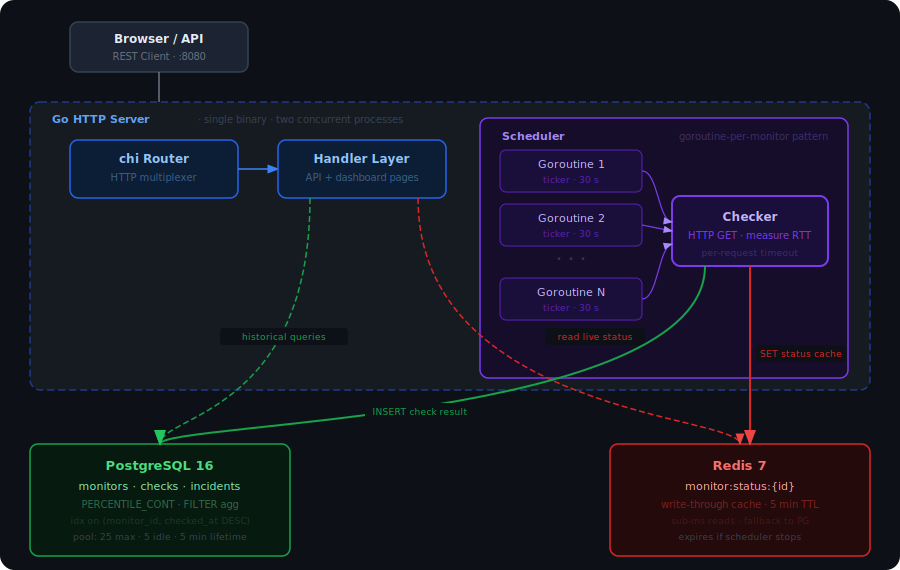

# Uptime Monitor

A real-time website uptime monitoring service built in Go. Register URLs to watch, and the service concurrently checks them at configurable intervals, stores every response in PostgreSQL, caches live status in Redis, and automatically tracks incidents — opening when a site goes down, resolving when it recovers.

Includes a server-rendered dashboard (Go templates + HTMX) that auto-refreshes every 10 seconds without a JavaScript framework.

## Architecture



Two independent processes run in the same Go binary: the **HTTP server** handles API requests and the dashboard, while the **Scheduler** runs background goroutines that continuously perform health checks — even with no users on the dashboard.

## Tech Stack

| Layer | Technology |
|-------|-----------|
| Language | Go 1.22 |
| HTTP Router | chi |
| Database | PostgreSQL 16 |
| Cache | Redis 7 |
| Dashboard | Go html/template + HTMX + Tailwind CSS + Chart.js |
| Infrastructure | Docker Compose, multi-stage Dockerfile |

## Quick Start

```bash
# Start everything (PostgreSQL + Redis + App)
make up

# Open the dashboard
open http://localhost:8080
```

**Development mode** (run Go server locally with databases in Docker):

```bash
make dev
```

## API

| Method | Path | Description |
|--------|------|-------------|
| `GET` | `/` | Dashboard UI |
| `GET` | `/monitors/{id}` | Monitor detail page |
| `POST` | `/api/monitors` | Create a monitor |
| `GET` | `/api/monitors` | List all monitors with live status |
| `GET` | `/api/monitors/{id}` | Get monitor details + uptime stats |
| `DELETE` | `/api/monitors/{id}` | Delete a monitor |
| `PATCH` | `/api/monitors/{id}/toggle` | Pause/resume monitoring |
| `GET` | `/api/monitors/{id}/checks` | Get paginated check history |

### Create a Monitor

```bash
curl -X POST http://localhost:8080/api/monitors \
  -H "Content-Type: application/json" \
  -d '{
    "name": "Google",
    "url": "https://google.com",
    "interval_seconds": 30,
    "timeout_seconds": 10,
    "expected_status": 200
  }'
```

### List Monitors

```bash
curl http://localhost:8080/api/monitors | jq
```

## Project Structure

```
├── cmd/server/main.go              # Entrypoint, graceful shutdown
├── internal/
│   ├── models/models.go            # Shared data types
│   ├── store/
│   │   ├── postgres.go             # All database operations
│   │   └── cache.go                # Redis status cache
│   ├── monitor/
│   │   ├── checker.go              # HTTP health check logic
│   │   └── scheduler.go            # Goroutine-per-monitor engine + incident reconciliation
│   └── handler/
│       ├── router.go               # Route definitions
│       ├── api.go                  # REST API handlers
│       ├── pages.go                # Dashboard page rendering
│       └── templates/              # Embedded HTML templates
├── migrations/001_init.sql         # Database schema
├── docker-compose.yml              # PostgreSQL + Redis + App
├── Dockerfile                      # Multi-stage build
└── Makefile                        # Build/run shortcuts
```

## How It Works

### Scheduler

The scheduler maintains a mutex-protected `map[monitorID]cancelFunc`. Calling `Schedule(monitor)` spawns a goroutine that immediately runs the first check, then fires on a `time.Ticker` at the configured interval. Calling `Unschedule(id)` cancels that goroutine's context. This is the goroutine-per-monitor pattern — each monitor's slow check never blocks another.

### Check Pipeline (per tick)

1. **Checker** — sends HTTP GET with per-request timeout, measures total round-trip latency
2. **PostgreSQL write** — inserts result into the `checks` time-series table
3. **Redis write** — updates `monitor:status:{id}` (5-minute TTL) for instant dashboard reads
4. **Incident reconciliation** — down + no open incident → create; up + open incident → resolve

### Incident Engine

A state machine that deduplicates alerts. A continuous outage becomes a single incident record with `started_at` and an eventual `resolved_at`. The `cause` field captures the actual error (e.g., `"dial tcp: no such host"`) for post-incident analysis.

### Dashboard

Server-rendered HTML with HTMX polling every 10 seconds — no React, no build step:

```html
<div hx-get="/partials/monitors" hx-trigger="every 10s" hx-swap="innerHTML">
```

### Caching Strategy

Write-through: every check writes to both PostgreSQL (permanent) and Redis (live cache). The dashboard reads from Redis (sub-ms), falling back to PostgreSQL on cache miss. Historical analytics — uptime %, P95 latency — always query PostgreSQL.

## Database Schema

| Table | Purpose |
|-------|---------|
| `monitors` | What to watch (URL, interval, timeout, expected status, enabled flag) |
| `checks` | Raw time-series results (is_up, status_code, response_time_ms, checked_at) |
| `incidents` | Outage records (started_at, resolved_at nullable, cause) |

Key index: `CREATE INDEX idx_checks_monitor_time ON checks(monitor_id, checked_at DESC)` — all dashboard and history queries filter on `monitor_id` and sort by time descending.

## Environment Variables

| Variable | Description |
|----------|-------------|
| `PORT` | HTTP server port (default: `8080`) |
| `DATABASE_URL` | PostgreSQL connection string |
| `REDIS_URL` | Redis connection string |

## What This Demonstrates

- **Concurrency** — goroutine-per-monitor with context cancellation and mutex-guarded lifecycle
- **Database design** — time-series schema with composite indexes, `PERCENTILE_CONT` for P95, `FILTER` for uptime %
- **Caching** — write-through Redis cache decoupling the read path from write-heavy check inserts
- **Incident management** — automatic open/resolve lifecycle with alert deduplication
- **API design** — RESTful JSON with correct status codes (201, 204), server-side defaults, pagination
- **Graceful shutdown** — SIGINT/SIGTERM handling that drains the scheduler before process exit
- **Server-side rendering** — Go templates with HTMX for live updates without a SPA
